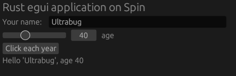

# Rust egui on Fermyon Spin

This project is the result of an **experiment** to use [Fermyon's Spin](https://www.fermyon.com/spin) to build and host a demo web application built using the [Rust egui UI library](https://www.egui.rs/#demo).

This experiment aimed at using **only** Spin to build, serve locally and deploy the egui application. I also added support to run the native egui application.

## Trying it out

Set your `spin` binary PATH in the `Makefile` heading `SPIN` variable.

Native local run:

```bash
$ make run
```

Web local run served by spin (then open http://127.0.0.1:3000 on your browser):

```bash
$ make up
```

Web deploy to Fermyon Cloud using spin (you'll need a working Fermyon Cloud account):

```bash
$ make deploy
```

## What to look at

The `spin.toml` describes the `egui-endpoint` static file serving component.

Take a special look at its `[component.build]` section which is where some magic happens:

- we prepare the `webapp` folder where we will be serving static files from
- we build the `egui-endpoint` WASM component (note the `wasm32-unknown-unknown` target)
- we `wasm-bindgen` our WASM to JavaScript to the `webapp` folder
- we copy the remaining `assets` and `index.html` to the `webapp` folder

You'll be interested to look at the `index.html` file as well to see how this is loaded up.

Then it's time to look at the `egui-endpoint` component itself and its `Cargo.toml` file.

- I found the `tracing-wasm` crate cool so we can use `tracing` to be converted to `console.log()` in the browser console!
- The `src/app.rs` file has the egui application model
- The `src/lib.rs` exports it
- The `src/main.rs` contains both the native and web (WASM) runners

## Screenshot

This is what it looks like btw.



## What's next?

I'll experiment with data persistence: would it be possible to use the Spin SDK to R/W data on the Fermyon Cloud from the egui application?!
